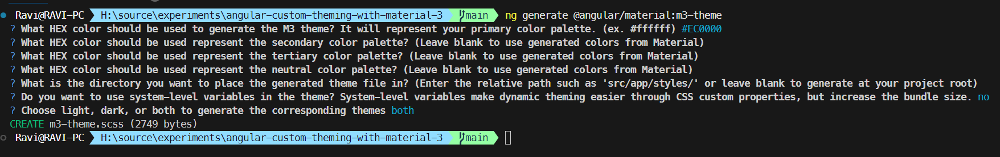

# Angular Custom Theming With Material 3

This example is built with Angular 18 and Material 3.

### Steps
- Create Angular Project

     ```ng new <project name>```

- Add Angular Material 
    
    ```ng add @angular/material```

- Generate Custom Theme and choose colors.

    ```ng generate @angular/material:m3-theme```

    In this example, 'use system-level variables' is not used.

    

- In your global 'styles.scss', add 
    ```
        @use "./m3-theme" as theme;

        ---

        :root {
            @include mat.all-component-themes(theme.$light-theme);
        }
    ```

    You can also choose to apply the theme per component instead of all components. See the repo for the full example.

- That's it. Done.

### Documentation

[https://material.angular.io/guide/theming](https://material.angular.io/guide/theming
)

[](https://www.youtube.com/watch?v=zPp4LopqFAc)

